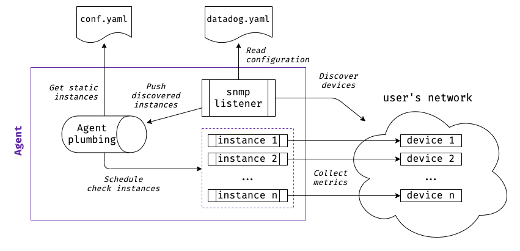
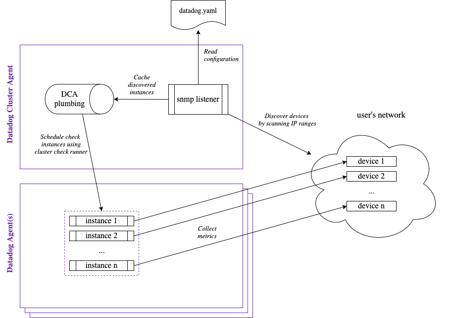

# SNMP

!!! note
    This section is meant for developers that want to understand the working of the SNMP integration.

    Be sure you are familiar with [SNMP concepts](../../tutorials/snmp/introduction/), and you have read through the official [SNMP integration docs](https://docs.datadoghq.com/integrations/snmp).

## Overview

While most integrations are either Python, JMX, or implemented in the Agent in Go, the SNMP integration is a bit more complex.

Here's an overview of what this integration involves:

* A [Python check](https://github.com/DataDog/datadog-agent/blob/master/snmp), responsible for:
    * Collecting metrics from a specific device IP. Metrics typically come from [profiles](../../tutorials/snmp/profile-format/), but they can also be [specified explicitly](https://github.com/DataDog/integrations-core/blob/fd6df90135de14d06662e49d7696a42c08476a82/snmp/datadog_checks/snmp/data/conf.yaml.example#L344-L354).
    * Auto-discovering devices over a network. (Pending deprecation in favor of Agent auto-discovery.)
* An [Agent service listener](https://github.com/DataDog/datadog-agent/blob/master/pkg/autodiscovery/listeners/snmp.go), responsible for auto-discovering devices over a network and forwarding discovered instances to the existing Agent check scheduling pipeline. Also known as "Agent SNMP auto-discovery".

The diagram below shows how these components interact for a typical VM-based setup (single Agent on a host). For Datadog Cluster Agent (DCA) deployments, see [Cluster Agent support](#cluster-agent-support).



## Python Check

### Dependencies

The Python check uses [PySNMP](https://github.com/etingof/pysnmp) to make SNMP queries and manipulate SNMP data (OIDs, variables, and MIBs).

### Device Monitoring

The primary functionality of the Python check is to collect metrics from a given device given its IP address.

As all Python checks, it supports multi-instances configuration, where each instance represents a device:

```yaml
instances:
  - ip_address: "192.168.0.12"
    # <Options...>
```

### Python Auto-Discovery

#### Approach

The Python check includes a multithreaded implementation of device auto-discovery. It runs on instances that use `network_address` instead of `ip_address`:

```yaml
instances:
  - network_address: "192.168.0.0/28"
    # <Options...>
```

The main tasks performed by device auto-discovery are:

* **Find new devices**: For each IP in the `network_address` CIDR range, the check queries the device `sysObjectID`. If the query succeeds and the `sysObjectID` matches one of the registered profiles, the device is added as a discovered instance. This logic is run at regular intervals in a separate thread.
* **Cache devices**: To improve performance, discovered instances are cached on disk based on a hash of the instance. Since options from the `network_address` instance are copied into discovered instances, the cache is invalidated if the `network_address` changes.
* **Check devices**: On each check run, the check runs a check on all discovered instances. This is done in parallel using a threadpool. The check waits for all sub-checks to finish.
* **Handle failures**: Discovered instances that fail after a configured number of times are dropped. They may be rediscovered later.
* **Submit discovery-related metrics**: the check submits the total number of discovered devices for a given `network_address` instance.

#### Caveats

The approach described above is not ideal for several reasons:

* The check code is harder to understand since the two distinct paths ("single device" vs "entire network") live in a single integration.
* Each network instance manages several long-running threads that span well beyond the lifespan of a single check run.
* Each network check pseudo-schedules other instances, which is normally the responsibility of the Agent.

For this reason, auto-discovery was eventually implemented in the Agent as a proper service listener (see below), and users should be discouraged from using Python auto-discovery. When the deprecation period expires, we will be able to remove auto-discovery logic from the Python check, making it exclusively focused on checking single devices.

## Agent Auto-Discovery

### Dependencies

Agent auto-discovery uses [GoSNMP](https://github.com/soniah/gosnmp) to get the `sysObjectID` of devices in the network.

### Standalone Agent

Agent auto-discovery implements the same logic than the Python auto-discovery, but as a service listener in the Agent Go package.

This approach leverages the existing Agent scheduling logic, and makes it possible to scale device auto-discovery using the Datadog Cluster Agent (see [Cluster Agent support](#cluster-agent-support)).

Pending official documentation, here is an example configuration:

```yaml
# datadog.yaml

listeners:
  - name: snmp

snmp_listener:
  configs:
    - network: 10.0.0.0/28
      version: 2
      community: public
    - network: 10.0.1.0/30
      version: 3
      user: my-snmp-user
      authentication_protocol: SHA
      authentication_key: "*****"
      privacy_protocol: AES
      privacy_key: "*****"
      ignored_ip_addresses:
        - 10.0.1.0
        - 10.0.1.1
```

### Cluster Agent Support

For Kubernetes environments, the [Cluster Agent](https://docs.datadoghq.com/agent/cluster_agent/) can be configured to use the SNMP Agent auto-discovery (via snmp listener) logic as a source of [Cluster checks](https://docs.datadoghq.com/agent/cluster_agent/clusterchecks/).



The Datadog Cluster Agent (DCA) uses the `snmp_listener` config (Agent auto-discovery) to listen for IP ranges, then schedules snmp check instances to be run by one or more normal Datadog Agents.

Agent auto-discovery combined with Cluster Agent is very scalable, it can be used to monitor a large number of snmp devices.

#### Example Cluster Agent setup with SNMP Agent auto-discovery using Datadog helm-chart

First you need to [add Datadog Helm repository](https://github.com/DataDog/helm-charts).

```bash
helm repo add datadog https://helm.datadoghq.com
helm repo update
```


Then run:

```bash
helm install datadog-monitoring --set datadog.apiKey=<YOUR_API_KEY> -f cluster-agent-values.yaml datadog/datadog
```

??? example "Example cluster-agent-values.yaml"

    ```yaml
    datadog:
      ## @param apiKey - string - required
      ## Set this to your Datadog API key before the Agent runs.
      ## ref: https://app.datadoghq.com/account/settings/agent/latest?platform=kubernetes
      #
      apiKey: <DATADOG_API_KEY>

      ## @param clusterName - string - optional
      ## Set a unique cluster name to allow scoping hosts and Cluster Checks easily
      ## The name must be unique and must be dot-separated tokens where a token can be up to 40 characters with the following restrictions:
      ## * Lowercase letters, numbers, and hyphens only.
      ## * Must start with a letter.
      ## * Must end with a number or a letter.
      ## Compared to the rules of GKE, dots are allowed whereas they are not allowed on GKE:
      ## https://cloud.google.com/kubernetes-engine/docs/reference/rest/v1beta1/projects.locations.clusters#Cluster.FIELDS.name
      #
      clusterName: my-snmp-cluster

      ## @param clusterChecks - object - required
      ## Enable the Cluster Checks feature on both the cluster-agents and the daemonset
      ## ref: https://docs.datadoghq.com/agent/autodiscovery/clusterchecks/
      ## Autodiscovery via Kube Service annotations is automatically enabled
      #
      clusterChecks:
        enabled: true

      ## @param tags  - list of key:value elements - optional
      ## List of tags to attach to every metric, event and service check collected by this Agent.
      ##
      ## Learn more about tagging: https://docs.datadoghq.com/tagging/
      #
      tags:
        - 'env:test-snmp-cluster-agent'

    ## @param clusterAgent - object - required
    ## This is the Datadog Cluster Agent implementation that handles cluster-wide
    ## metrics more cleanly, separates concerns for better rbac, and implements
    ## the external metrics API so you can autoscale HPAs based on datadog metrics
    ## ref: https://docs.datadoghq.com/agent/kubernetes/cluster/
    #
    clusterAgent:
      ## @param enabled - boolean - required
      ## Set this to true to enable Datadog Cluster Agent
      #
      enabled: true

      ## @param confd - list of objects - optional
      ## Provide additional cluster check configurations
      ## Each key will become a file in /conf.d
      ## ref: https://docs.datadoghq.com/agent/autodiscovery/
      #
      confd:
        # Static checks
        http_check.yaml: |-
          cluster_check: true
          instances:
            - name: 'Check Example Site1'
              url: http://example.net
            - name: 'Check Example Site2'
              url: http://example.net
            - name: 'Check Example Site3'
              url: http://example.net
        # Autodiscovery template needed for `snmp_listener` to create instance configs
        snmp.yaml: |-
          cluster_check: true

          # AD config below is copied from: https://github.com/DataDog/datadog-agent/blob/master/cmd/agent/dist/conf.d/snmp.d/auto_conf.yaml
          ad_identifiers:
            - snmp
          init_config:
          instances:
            -
              ## @param ip_address - string - optional
              ## The IP address of the device to monitor.
              #
              ip_address: "%%host%%"

              ## @param port - integer - optional - default: 161
              ## Default SNMP port.
              #
              port: "%%port%%"

              ## @param snmp_version - integer - optional - default: 2
              ## If you are using SNMP v1 set snmp_version to 1 (required)
              ## If you are using SNMP v3 set snmp_version to 3 (required)
              #
              snmp_version: "%%extra_version%%"

              ## @param timeout - integer - optional - default: 5
              ## Amount of second before timing out.
              #
              timeout: "%%extra_timeout%%"

              ## @param retries - integer - optional - default: 5
              ## Amount of retries before failure.
              #
              retries: "%%extra_retries%%"

              ## @param community_string - string - optional
              ## Only useful for SNMP v1 & v2.
              #
              community_string: "%%extra_community%%"

              ## @param user - string - optional
              ## USERNAME to connect to your SNMP devices.
              #
              user: "%%extra_user%%"

              ## @param authKey - string - optional
              ## Authentication key to use with your Authentication type.
              #
              authKey: "%%extra_auth_key%%"

              ## @param authProtocol - string - optional
              ## Authentication type to use when connecting to your SNMP devices.
              ## It can be one of: MD5, SHA, SHA224, SHA256, SHA384, SHA512.
              ## Default to MD5 when `authKey` is specified.
              #
              authProtocol: "%%extra_auth_protocol%%"

              ## @param privKey - string - optional
              ## Privacy type key to use with your Privacy type.
              #
              privKey: "%%extra_priv_key%%"

              ## @param privProtocol - string - optional
              ## Privacy type to use when connecting to your SNMP devices.
              ## It can be one of: DES, 3DES, AES, AES192, AES256, AES192C, AES256C.
              ## Default to DES when `privKey` is specified.
              #
              privProtocol: "%%extra_priv_protocol%%"

              ## @param context_engine_id - string - optional
              ## ID of your context engine; typically unneeded.
              ## (optional SNMP v3-only parameter)
              #
              context_engine_id: "%%extra_context_engine_id%%"

              ## @param context_name - string - optional
              ## Name of your context (optional SNMP v3-only parameter).
              #
              context_name: "%%extra_context_name%%"

              ## @param tags - list of key:value element - optional
              ## List of tags to attach to every metric, event and service check emitted by this integration.
              ##
              ## Learn more about tagging: https://docs.datadoghq.com/tagging/
              #
              tags:
                # The autodiscovery subnet the device is part of.
                # Used by Agent autodiscovery to pass subnet name.
                - "autodiscovery_subnet:%%extra_autodiscovery_subnet%%"

              ## @param extra_tags - string - optional
              ## Comma separated tags to attach to every metric, event and service check emitted by this integration.
              ## Example:
              ##  extra_tags: "tag1:val1,tag2:val2"
              #
              extra_tags: "%%extra_tags%%"

              ## @param oid_batch_size - integer - optional - default: 60
              ## The number of OIDs handled by each batch. Increasing this number improves performance but
              ## uses more resources.
              #
              oid_batch_size: "%%extra_oid_batch_size%%"

      ## @param datadog-cluster.yaml - object - optional
      ## Specify custom contents for the datadog cluster agent config (datadog-cluster.yaml).
      #
      datadog_cluster_yaml:
        listeners:
          - name: snmp

        # See here for all `snmp_listener` configs: https://github.com/DataDog/datadog-agent/blob/master/pkg/config/config_template.yaml
        snmp_listener:
          workers: 2
          discovery_interval: 10
          configs:
            - network: 192.168.1.16/29
              version: 2
              port: 1161
              community: cisco_icm
            - network: 192.168.1.16/29
              version: 2
              port: 1161
              community: f5
    ```

> TODO: architecture diagram, example setup, affected files and repos, local testing tools, etc.
