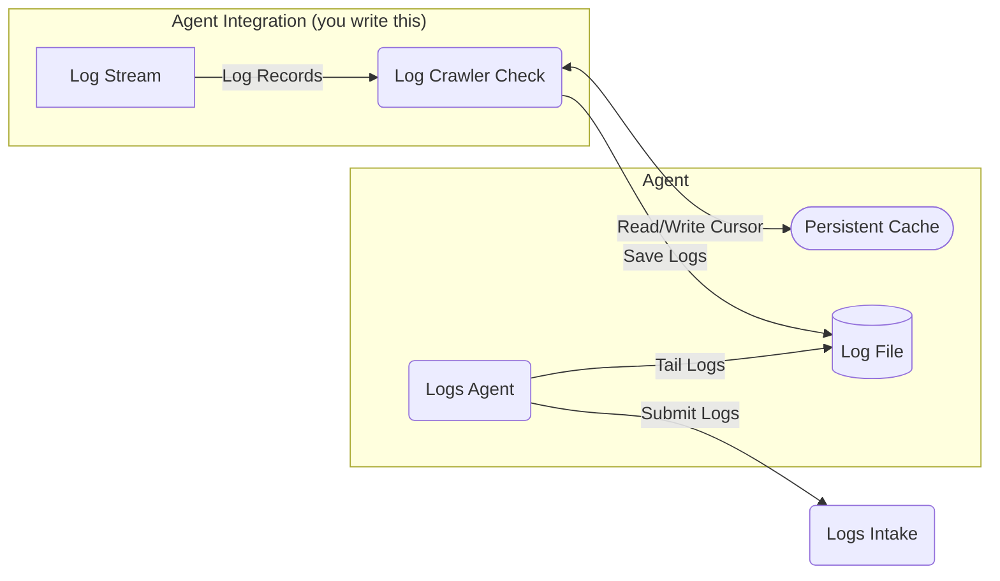

# Log Crawlers

## Overview

Some systems expose their logs from HTTP endpoints instead of files that the Logs Agent can tail.
In such cases, you can create an Agent integration to crawl the endpoints and submit the logs.

To avoid data loss and duplication, the `LogCrawlerCheck` uses the [persistent cache](./persistent-cache.md) to store the log cursor for each log stream. This allows the integration to resume crawling from its last known position after an Agent restart.

The following diagram illustrates how crawling logs integrates into the Datadog Agent.

## Interface

::: datadog_checks.base.checks.logs.crawler.base.LogCrawlerCheck
    options:
      heading_level: 3
      members:
        - get_log_streams
        - process_streams
        - check

::: datadog_checks.base.checks.logs.crawler.stream.LogStream
    options:
      heading_level: 3
      members:
        - records
        - __init__

::: datadog_checks.base.checks.logs.crawler.stream.LogRecord
    options:
      heading_level: 3
      members: []
