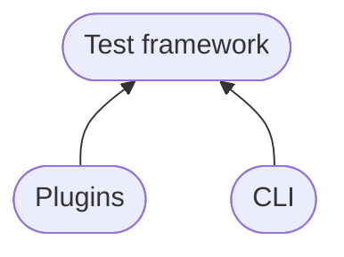

# What's in the box?

-----

    <video preload="auto" autoplay loop muted>
        <source src="https://media.giphy.com/media/OuUZAQSyGSfHG/giphy.mp4" type="video/mp4"></source>
    </video>

The [Dev package][datadog-checks-dev], often referred to as its [CLI](cli.md) entrypoint `ddev`, is fundamentally split into 2 parts.

## Test framework

The [test framework](test.md) provides everything necessary to test integrations, such as:

- Dependencies like [pytest][pytest-github], [mock][mock-github], [requests][requests-github], etc.
- Utilities for consistently handling complex logic or common operations
- An [orchestrator](plugins.md#environment-manager) for arbitrary E2E environments

## CLI

The [CLI](cli.md) provides the interface through which tests are invoked, E2E environments are managed, and general repository maintenance (such as dependency management) occurs.

## Separation

As the dependencies of the test framework are a subset of what is required for the CLI, the CLI tooling may import from the test framework, but not vice versa.

The diagram below shows the import hierarchy between each component. Clicking a node will open that component's location in the source code.

--8<-- "uml.txt"
