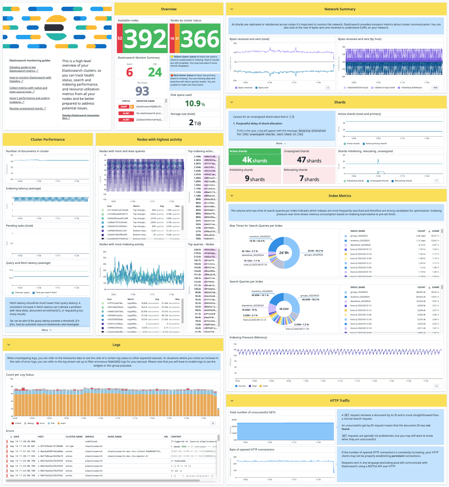
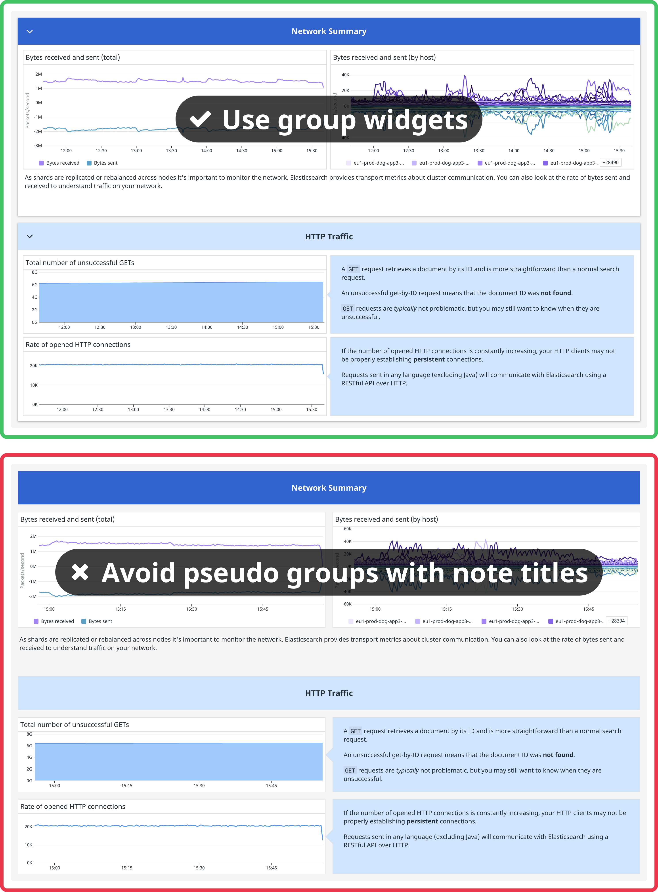
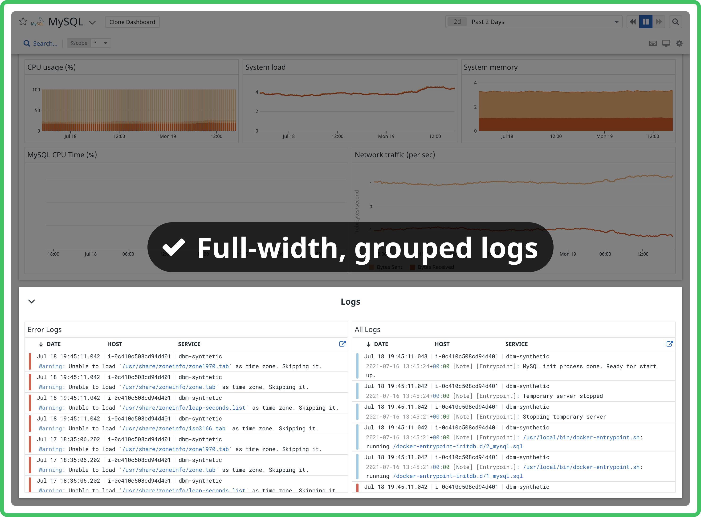
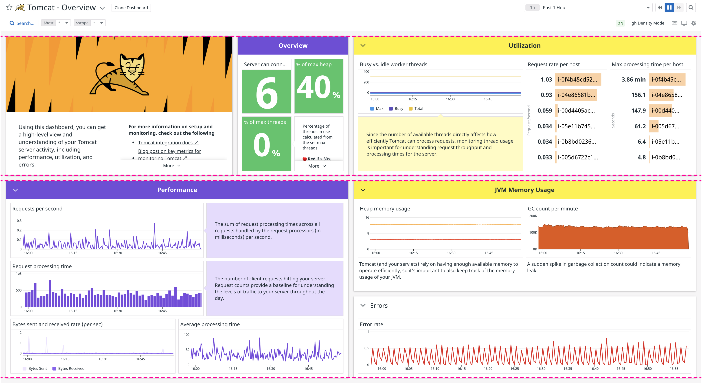
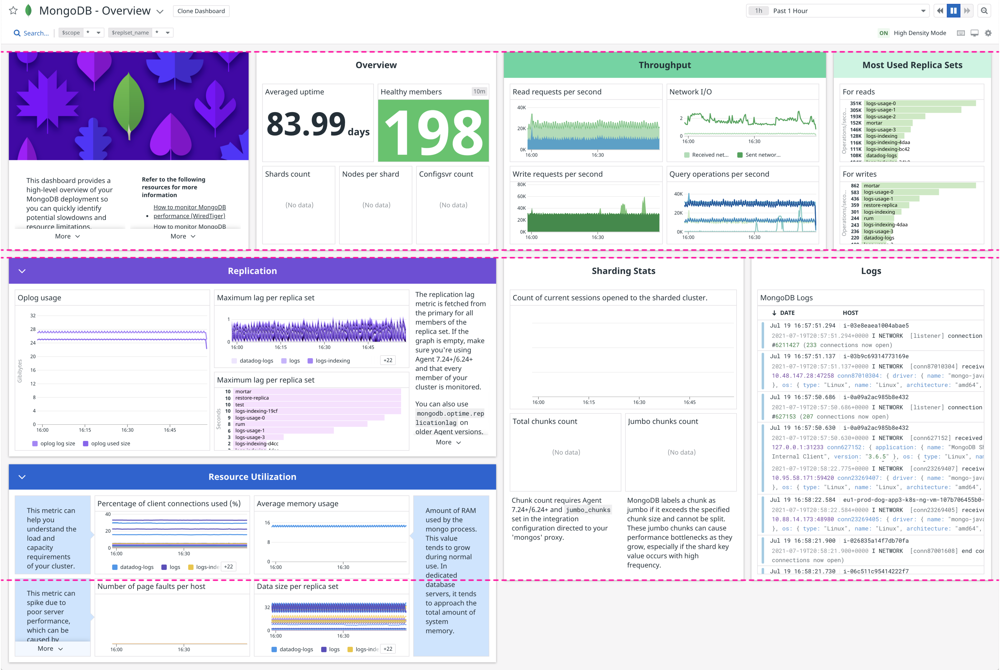
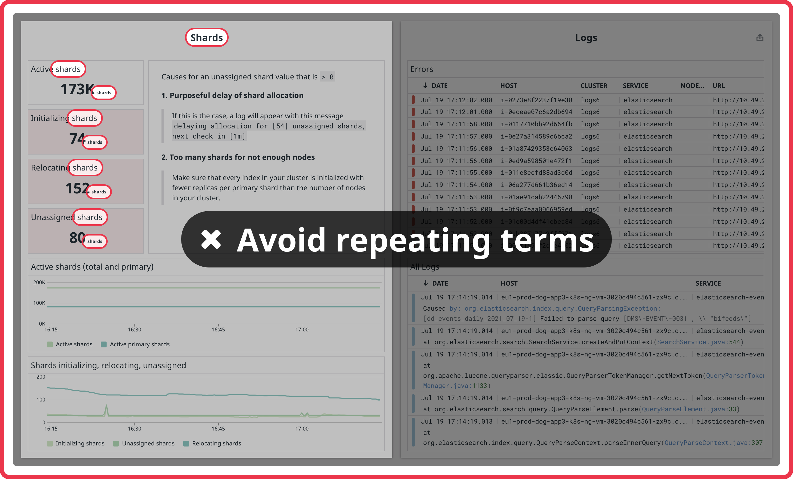
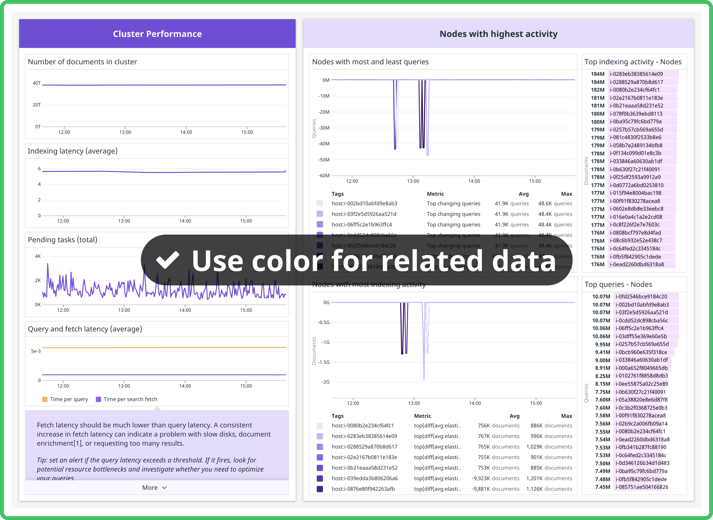
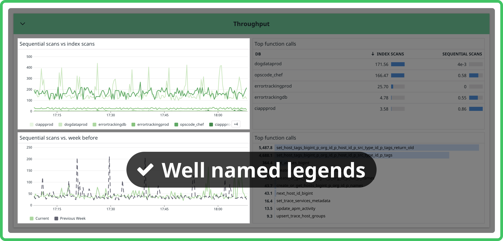
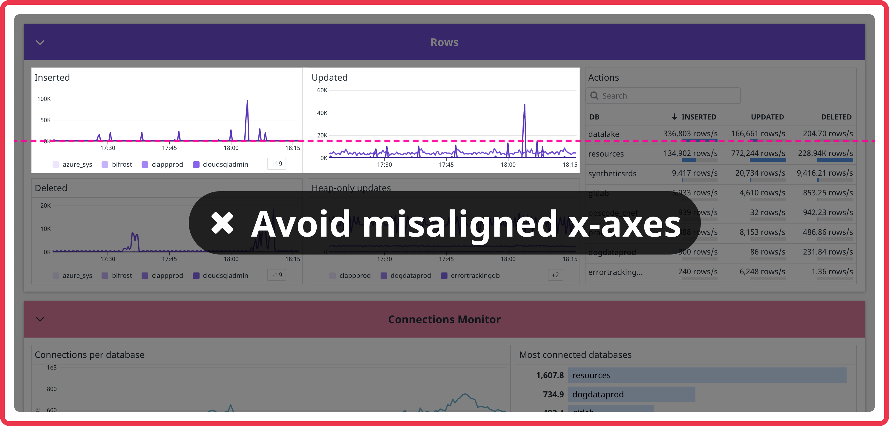

# Dashboards

-----

Datadog dashboards enable you to efficiently monitor your infrastructure and integrations by displaying and tracking key metrics.

## Integration Preset Dashboards

If you would like to create a default dashboard for an integration, follow the guidelines in the [Best Practices](#best-practices) section.

### Exporting a dashboard payload

When you've created a dashboard in the Datadog UI, you can export the dashboard payload to be included in its integration's assets directory.

Ensure that you have [set](../ddev/cli.md#ddev-config-set) an `api_key` and `app_key` for the org that contains the new dashboard in the [`ddev` configuration](../ddev/configuration.md#organization).

Run the following command to [export the dashboard](../ddev/cli.md#ddev-meta-dash-export):

```console
ddev meta dash export <URL_OF_DASHBOARD> <INTEGRATION>
```

!!! tip
    If the dashboard is for a contributor-maintained integration in the `integration-extras` repo, run the command with the `--extras` or `-e` flag.

The command will add the dashboard definition to the `manifest.json` file of the integration.
The dashboard JSON payload will be available in `/assets/dashboards/<DASHBOARD_TITLE>.json`.

!!! tip
    The dashboard is available at the following address `/dash/integration/<DASHBOARD_KEY>` in each region, where `<DASHBOARD_KEY>` is the one you have in the `manifest.json` file of the integration for this dashboard. This can be useful when you want to add a link to another dashboard inside your dashboard.

Commit the changes and create a pull request.

### Verify the Preset Dashboard

Once your PR is merged and synced on production, you can find your dashboard in the Dashboard List page.

!!! tip
    Make sure the integration tile is `Installed` in order to see the preset dashboard in the list.

Ensure logos render correctly on the Dashboard List page and within the preset dashboard.

## Best Practices

### Example of a great integration dashboard



- [x] Attention-grabbing "about" section with a banner image, concise copy, useful links, and a good typography hierarchy
- [x] A brief, annotated "overview" section with the most important statistics, right at the top
- [x] Simple graph titles and title-case group names
- [x] Nearly symmetrical in high density mode
- [x] Well formatted, concise notes
- [x] Color coordination between related groups, notes within groups, and graphs within groups

Follow the guidelines below as you build your dashboard to achieve something similar.

### General

1. When creating a new dashboard, select the default dashboard type (internally called multisize layout).

1. Dashboard titles should contain the integration name. Some examples of a good dashboard title are `Syclla` and `Cilium Overview`.

    !!! warning
        Avoid using ++hyphen++ (hyphen) in the dashboard title as the dashboard URL is generated from the title.
        
1. Add a logo to the dashboard header. The integration logo will automatically appear in the header if the icon exists [here](http://app.datadoghq.com/internal/styleguide/logos/logo-gallery?variant=avatar) and the `integration_id` matches the icon name. That means it will only appear when the dashboard you're working on is made into the official integration board.
   

1. Always include an "about" group for the integration containing a brief description and helpful links. Also include an "overview" group containing a few of the most important metrics, and place it at the top of the dashboard. Edit the "about" group and select the "banner" display option, then link to a banner image like this: `/static/images/integration_dashboard/your-image.png`. For instructions on how to create and upload a banner image, go to the [DRUIDS logo gallery](https://druids.us1.prod.dog/logos/logo-gallery), click the relevant logo, and click the "Dashboard Banner" tab. The "about" section should contain content, not data; the "overview" section should contain data. Avoid making the "about" section full-width.
   
   
1. Research the metrics supported by the integration and consider grouping them in relevant categories.
Important metrics that are key to the performance and overview of the integration should be at the top.

1. Use Group widgets to title and group sections, rather than note widgets as you might on a screenboard. Use partial width groups to display groups side-by-side. Most dashboards should display every widget within a group.
   

1. Timeseries widgets should be at least 4 columns wide in order not to appear squashed on smaller displays

1. Stream widgets should be at least 6 columns wide (half the dashboard width) for readability. You should place them at the end of a dashboard so they don't "trap" scrolling. It's useful to put stream widgets in a group by themselves so they can be collapsed. Add an event stream only if the service monitored by the dashboard is reporting events. Use `sources:service_name`.
   

1. Which widgets best represent your data? Try using a mix of widget types and sizes. Explore visualizations and formatting options until you're confident your dashboard is as clear as it can be. Sometimes a whole dashboard of timeseries is ok, but other times variety can improve things. The most commonly used metric widgets are [timeseries](https://docs.datadoghq.com/dashboards/widgets/timeseries/), [query values](https://docs.datadoghq.com/dashboards/widgets/query_value/), and [tables](https://docs.datadoghq.com/dashboards/widgets/table/). For more information on the available widget types, see the [list of supported dashboard widgets](https://docs.datadoghq.com/dashboards/widgets/).

1. Try to make the left and right halves of your dashboard symmetrical in high density mode. Users with large monitors will see your dashboard in high density mode by default, so it's important to make sure the group relationships make sense, and the dashboard looks good. You can adjust group heights to achieve this, and move groups between the left and right halves.

    a. _(perfectly symmetrical)_
       

    b. _(close enough)_
       

1. [Template variables](https://docs.datadoghq.com/dashboards/template_variables/) allow you to dynamically filter one or more widgets in a dashboard. Template variables must be universal and accessible by any user or account using the monitored service. Make sure all relevant graphs are listening to the relevant template variable filters.

    !!! tip
        Adding `*=scope` as a template variable is useful since users can access all their own tags.

### Copy

1. Prefer concise graph titles that start with the most important information. Avoid common phrases such as "number of", and don't include the integration title e.g. "Memcached Load".

    | Concise title (good) | Verbose title (bad) |
    | - | - |
    | Events per node | Number of Kubernetes events per node |
    | Pending tasks: [$node_name] | Total number of pending tasks in [$node_name] |
    | Read/write operations | Number of read/write operations |
    | Connections to server - rate | Rate of connections to server |
    | Load | Memcached Load |

1. Avoid repeating the group title or integration name in every widget in a group, especially if the widgets are query values with a custom unit of the same name. Note the word "shards" in each widget title in the group named "shards".
   

1. Always alias formulas

1. Group titles should be title case. Widget titles should be sentence case.

1. If you're showing a legend, make sure the aliases are easy to understand.

1. Graph titles should summarize the queried metric. Do not indicate the unit in the graph title because unit types are displayed automatically from metadata. An exception to this is if the calculation of the query represents a different type of unit.

### QA

1. Always check a dashboard at 1280px wide and 2560px wide to see how it looks on a smaller laptop and a larger monitor. The most common screen widths for dashboards are 1920, 1680, 1440, 2560, and 1280px, making up more than half of all dashboard page views combined.
   

    !!! tip
        If your monitor isn't large enough for high density mode, use the browser zoom controls to zoom out.

### Visual Style

1. Format notes to make them fit their use case. Try the presets "caption", "annotation", or "header", or pick your own combination of styles. Avoid using the smallest font size for notes that are long or include complex formatting, like bulleted lists or code blocks.

1. Use colors to highlight important relationships and to improve readability, not for style. If several groups are related, apply the same group header color to all of them. If you've applied a green header color to a group, try making its notes green as well. If two groups are related, but one is more important, try using the "vivid" color on the important group and the "light" color on the less important group. Don't be afraid to leave groups with white headers, and be careful not to overuse color e.g. don't make every group on a dashboard vivid blue. Also avoid using gray headers.
   

1. Use legends when they make sense. Legends make it easy to read a graph without having to hover over each series or maximize the widget. Make sure you use aliases so the legend is easy to read. Automatic mode for legends is a great option that hides legends when space is tight and shows them when there's room.
   

1. If you want users to compare two graphs side-by-side, make sure their x-axes align. If one graph is showing a legend and the other isn't, the x-axes won't align - make sure they either both show a legend or both do not.
   

1. For timeseries, base the display type on the type of metric

    | Types of metric | Display type |
    | - | - |
    | Volume (e.g. Number of connections) | `area` |
    | Counts (e.g. Number of errors) | `bars` |
    | Multiple groups or default | `lines` |
