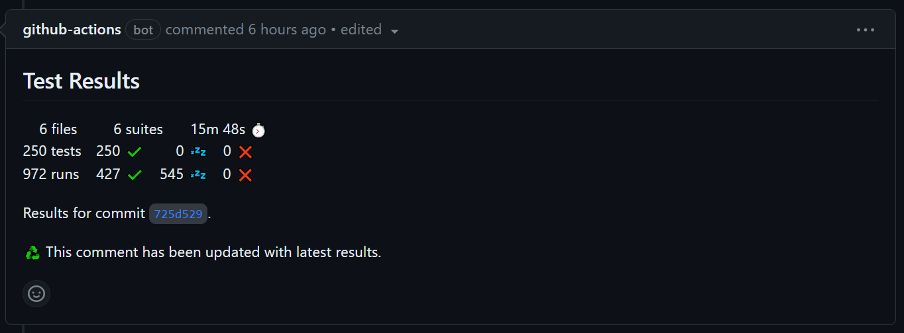

# Testing

-----

## Workflows

- [Master](https://github.com/DataDog/integrations-core/blob/master/.github/workflows/master.yml) - Runs tests on Python 3 for [every target](#target-enumeration) on merges to the `master` branch
- [PR](https://github.com/DataDog/integrations-core/blob/master/.github/workflows/pr.yml) - Runs tests on Python 2 & 3 for any modified target in a pull request as long as the base or developer packages were not modified
- [PR All](https://github.com/DataDog/integrations-core/blob/master/.github/workflows/pr-all.yml) - Runs tests on Python 2 & 3 for [every target](#target-enumeration) in a pull request if the base or developer packages were modified
- [Nightly minimum base package test](https://github.com/DataDog/integrations-core/blob/master/.github/workflows/nightly-base-package.yml) - Runs tests for [every target](#target-enumeration) once nightly using the minimum declared required version of the base package
- [Nightly Python 2 tests](https://github.com/DataDog/integrations-core/blob/master/.github/workflows/nightly-py2.yml) - Runs tests on Python 2 for [every target](#target-enumeration) once nightly
- [Test Agent release](https://github.com/DataDog/integrations-core/blob/master/.github/workflows/test-agent.yml) - Runs tests for [every target](#target-enumeration) when manually scheduled using specific versions of the Agent for E2E tests

## Reusable workflows

These can be [used](https://docs.github.com/en/actions/using-workflows/reusing-workflows) by other repositories.

### PR test

This [workflow](https://github.com/DataDog/integrations-core/blob/master/.github/workflows/pr-test.yml) is meant to be used on pull requests.

First it [computes the job matrix](https://github.com/DataDog/integrations-core/blob/master/.github/workflows/compute-matrix.yml) based on what was changed. Since this is time sensitive, rather than fetching the entire history we use GitHub's API to find out the precise depth to fetch in order to reach the merge base. Then it runs the [test workflow](#test-target) for every job in the matrix.

!!! note
    Changes that match any of the following patterns inside a directory will trigger the testing of that target:

    - `assets/configuration/**/*`
    - `tests/**/*`
    - `*.py`
    - `hatch.toml`
    - `metadata.csv`
    - `pyproject.toml`

!!! warning
    A matrix is [limited](https://docs.github.com/en/actions/using-jobs/using-a-matrix-for-your-jobs#using-a-matrix-strategy) to 256 jobs. Rather than allowing a workflow error, the [matrix generator](https://github.com/DataDog/integrations-core/blob/master/ddev/src/ddev/utils/scripts/ci_matrix.py) will enforce the cap and emit a warning.

### Test target

This [workflow](https://github.com/DataDog/integrations-core/blob/master/.github/workflows/test-target.yml) runs a single job that is the foundation of how all tests are executed. Depending on the input parameters, the order of operations is as follows:

- [Checkout](https://github.com/actions/checkout) code (on pull requests this is a [merge commit](https://docs.github.com/en/actions/using-workflows/events-that-trigger-workflows#pull_request))
- [Set up](https://github.com/actions/setup-python) Python 2.7
- [Set up](https://github.com/actions/setup-python) the [Python version](#python-version) the Agent currently ships
- [Restore](https://github.com/actions/cache/tree/main/restore) dependencies from [the cache](#caching)
- Install & configure [ddev](https://github.com/DataDog/integrations-core/tree/master/ddev)
- Run any [setup scripts](#target-setup) the target requires
- Start an [HTTP server](https://github.com/DataDog/integrations-core/blob/master/.ddev/ci/scripts/traces.py) to capture [traces](#tracing)
- Run unit & integration tests
- Run [E2E](../../e2e.md#testing) tests
- Run [benchmarks](../../ddev/test.md#benchmarks)
- [Upload](https://github.com/actions/upload-artifact) captured [traces](#tracing)
- [Upload](https://github.com/actions/upload-artifact) collected [test results](#test-results)
- [Submit](https://github.com/codecov/codecov-action) coverage statistics to [Codecov](https://codecov.io)

## Target setup

Some targets require additional set up such as the installation of system dependencies. Therefore, all such logic is put into [scripts](https://github.com/DataDog/integrations-core/tree/master/.ddev/ci/scripts) that live under `/.ddev/ci/scripts`.

As targets may need different set up on different platforms, all scripts live under a directory named after the [platform ID](#platforms). All scripts in the directory are executed in lexicographical order. Files in the scripts directory whose names begin with an underscore are not executed.

The step that executes these scripts is the only step that has access to [secrets](#secrets).

### Secrets

Since environment variables defined in a workflow [do not propagate](https://docs.github.com/en/actions/using-workflows/reusing-workflows#limitations) to reusable workflows, secrets [must](https://docs.github.com/en/actions/using-workflows/workflow-syntax-for-github-actions#onworkflow_callinputsinput_idtype) be passed as a JSON string representing a map.

Both the [PR test](#pr-test) and [Test target](#test-target) reusable workflows for testing accept a `setup-env-vars` input parameter that defines the environment variables for the setup step. For example:

```yaml
jobs:
  test:
    uses: DataDog/integrations-core/.github/workflows/pr-test.yml@master
    with:
      repo: "<NAME>"
      setup-env-vars: >-
        ${{ format(
          '{{
            "PYTHONUNBUFFERED": "1",
            "SECRET_FOO": "{0}",
            "SECRET_BAR": "{1}"
          }}',
          secrets.SECRET_FOO,
          secrets.SECRET_BAR
        )}}
```

!!! note
    Secrets for [integrations-core](https://github.com/DataDog/integrations-core) itself are defined as the default value in the [base workflow](#test-target).

### Environment variable persistence

If environment variables need to be available for testing, you can add a script that [writes to the file](https://docs.github.com/en/actions/using-workflows/workflow-commands-for-github-actions#setting-an-environment-variable) defined by the `GITHUB_ENV` environment variable:

```bash
#!/bin/bash
set -euo pipefail

set +x
echo "LICENSE_KEY=$LICENSE_KEY" >> "$GITHUB_ENV"
set -x
```

## Target configuration

Configuration for targets [lives](https://github.com/DataDog/integrations-core/blob/master/.ddev/config.toml) under the `overrides.ci` key inside a `/.ddev/config.toml` file.

!!! note
    Targets are referenced by the name of their directory.

### Platforms

| Name | ID | Default runner |
| --- | --- | --- |
| Linux | `linux` | [Ubuntu 22.04](https://github.com/actions/runner-images/blob/main/images/linux/Ubuntu2204-Readme.md) |
| Windows | `windows` | [Windows Server 2022](https://github.com/actions/runner-images/blob/main/images/win/Windows2022-Readme.md) |
| macOS | `macos` | [macOS 12](https://github.com/actions/runner-images/blob/main/images/macos/macos-12-Readme.md) |

If an integration's `manifest.json` indicates that the only supported platform is Windows then that will be used to run tests, otherwise they will run on Linux.

To override the platform(s) used, one can set the `overrides.ci.<TARGET>.platforms` array. For example:

```toml
[overrides.ci.sqlserver]
platforms = ["windows", "linux"]
```

### Runners

To override the runners for each platform, one can set the `overrides.ci.<TARGET>.runners` mapping of [platform IDs](#platforms) to [runner labels](https://docs.github.com/en/actions/using-workflows/workflow-syntax-for-github-actions#choosing-github-hosted-runners). For example:

```toml
[overrides.ci.sqlserver]
runners = { windows = ["windows-2019"] }
```

### Exclusion

To disable testing, one can enable the `overrides.ci.<TARGET>.exclude` option. For example:

```toml
[overrides.ci.hyperv]
exclude = true
```

## Target enumeration

The [list](https://github.com/DataDog/integrations-core/blob/master/.github/workflows/test-all.yml) of all jobs is [generated](validation.md#ci-configuration) as the `/.github/workflows/test-all.yml` file.

This reusable workflow is called by workflows that need to test everything.

## Tracing

During testing we use [ddtrace](https://github.com/DataDog/dd-trace-py) to submit [APM data](https://docs.datadoghq.com/tracing/) to the [Datadog Agent](https://docs.datadoghq.com/agent/). To avoid every job pulling the Agent, these HTTP trace requests are captured and saved to a [newline-delimited JSON](https://en.wikipedia.org/wiki/JSON_streaming#Newline-Delimited_JSON) file.

A [workflow](https://github.com/DataDog/integrations-core/blob/master/.github/workflows/submit-traces.yml) then runs after all jobs are finished and [replays](https://github.com/DataDog/integrations-core/blob/master/.ddev/ci/scripts/traces.py) the requests to the Agent. At the end the artifact is [deleted](https://github.com/geekyeggo/delete-artifact) to avoid needless storage persistence and also so if individual jobs are rerun that only the new traces will be submitted.

We maintain a [public dashboard](https://p.datadoghq.com/sb/yB5yjZ-e9572aadd5162263629114009c09dce1) for monitoring our CI.

## Test results

After all test jobs in a workflow complete we [publish](https://github.com/EnricoMi/publish-unit-test-result-action) the results.

On pull requests we [create](https://github.com/DataDog/integrations-core/blob/master/.github/workflows/test-results-pr.yml) a single comment that remains updated:

{ loading=lazy }

On merges to the `master` branch we [generate](https://github.com/DataDog/integrations-core/blob/master/.github/workflows/test-results-master.yml) a [badge](https://github.com/DataDog/integrations-core/blob/badges/test-results.svg) with stats about all tests:

[{ loading=lazy }](https://github.com/DataDog/integrations-core/actions/workflows/master.yml)

## Caching

A [workflow](https://github.com/DataDog/integrations-core/blob/master/.github/workflows/cache-shared-deps.yml) runs on merges to the `master` branch that, if the files defining the dependencies have not changed, [saves](https://github.com/actions/cache/blob/main/save/README.md) the dependencies shared by all targets for the current [Python version](#python-version) for each [platform](#platforms).

During [testing](#test-target) the cache is restored, with a fallback to an older compatible version of the cache.

## Python version

Tests by default use the Python version the Agent currently ships. This value must be changed in the following locations:

- `PYTHON_VERSION` environment variable in [/.github/workflows/cache-shared-deps.yml](https://github.com/DataDog/integrations-core/blob/master/.github/workflows/cache-shared-deps.yml)
- `PYTHON_VERSION` environment variable in [/.github/workflows/run-validations.yml](https://github.com/DataDog/integrations-core/blob/master/.github/workflows/run-validations.yml)
- `PYTHON_VERSION` environment variable fallback in [/.github/workflows/test-target.yml](https://github.com/DataDog/integrations-core/blob/master/.github/workflows/test-target.yml)

## Caveats

### Windows performance

The first command invocation is extraordinarily slow (see [actions/runner-images#6561](https://github.com/actions/runner-images/issues/6561)). Bash appears to be the least affected so we set that as the [default shell](https://docs.github.com/en/actions/using-workflows/workflow-syntax-for-github-actions#defaultsrun) for all workflows that run commands.

!!! note
    The official checkout action is affected by a similar issue (see [actions/checkout#1246](https://github.com/actions/checkout/pull/1246#issuecomment-1499276093)) that has been narrowed down to disk I/O.
